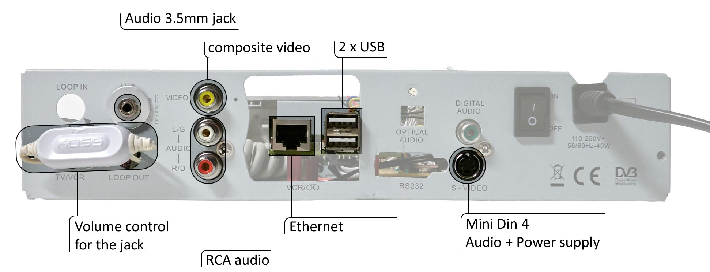

# Console de jeux Troubadour - RetroPie

Troubadour est une console de jeux Rétro utilisant la distribution RetroPie, et installée dans un ancien décodeur TNT [Metronic Zapbox Easy 2](http://www.fnac.com/Metronic-Zapbox-Easy-2/a1663879/w-4) appelé MZE2 par la suite.

## Mises à jour
* **2016/08/07** - Mise à jour de la doc.
* **2016/08/02** - Création de ce répertoire.

## Fonctionnalités
* Équipée d'un Raspberry Pi B
* Alimentation électrique provenant du vieux décodeur TNT
* Panneau frontal original utilisé : contrôle du volume, affichage d'informations, bouton d'extinction.   Voir [doc/usage.md](doc/usage.md) pour plus d'infos.
* La plupart des connecteurs originaux sont utilisés
* Connecteur d'alimentation +5V USB, pour petites enceintes.
* compatible avec la plupart des TV (HDMI et Composite (RCA AV))

Panneau arrière de Troubadour :

## Fabriquez la vôtre

### Cablâge interne
Voir [doc/wiring.md](doc/wiring.md)

### Script de contrôle du volume
Voir [doc/vol_install.md](doc/vol_install.md)

### Compiler le programme du panneau frontal
Le program est écrit en C and se lance au démarrage du PI.
Voir [doc/build.md](doc/build.md)

### Démontage compréhensif (Reverse Engineering) sur le panneau frontal
Voir [doc/frontPanel_hack.md](doc/frontPanel_hack.md).

### Ajouter des fonctionnalités au panneau frontal
Vous pouvez ajoutez des fonctionnalités en modifiant le fichier frontPanel.c, voir [How To Program the front panel](how_to_program.md) pour apprendre comment.

## License
[GNU GPL v3](LICENSE)