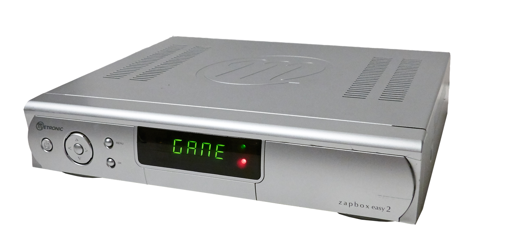

# Troubadour - RetroPie system
Troubadour is a RetroPie video games console installed in an old french TV decoder, a [Metronic Zapbox Easy 2](http://www.fnac.com/Metronic-Zapbox-Easy-2/a1663879/w-4) called MZE2 below.

**Fr**   
Troubadour est une console de jeux Rétro utilisant la distribution RetroPie, et installée dans un ancien décodeur TNT [Metronic Zapbox Easy 2](http://www.fnac.com/Metronic-Zapbox-Easy-2/a1663879/w-4) appelé MZE2 par la suite.
Pour plus d'infos en français voir [LISEZMOI.MD](LISEZMOI.MD)

## Updates
* **2016/08/07** - Update the doc.
* **2016/08/02** - Create this repository.

## Features
* Powered with a Raspberry Pi B.
* Power supply from the old TV decoder.
* Original front panel used : volume control, display infos, shutdown button.    See [doc/usage.md](doc/usage.md) for more details.
* Most of the original connectors were used.
* HDMI, Composite compatible : usable on most TV.

Rear panel of Troubadour :

## Build your own

### Internal Wiring
See [doc/wiring.md](doc/wiring.md)

### Volume control script
See [doc/vol_install.md](doc/vol_install.md)

### Build the front panel program
The program is written in C and launch on startup.   
See [doc/build.md](doc/build.md) for further details.

### Reverse engineering the front panel
See [doc/frontPanel_hack.md](doc/frontPanel_hack.md).

### Add features to the front panel
You can add more features by editing the frontPanel.c program, see [How To Program the front panel](how_to_program.md) to learn how.

## License
[GNU GPL v3](LICENSE)
