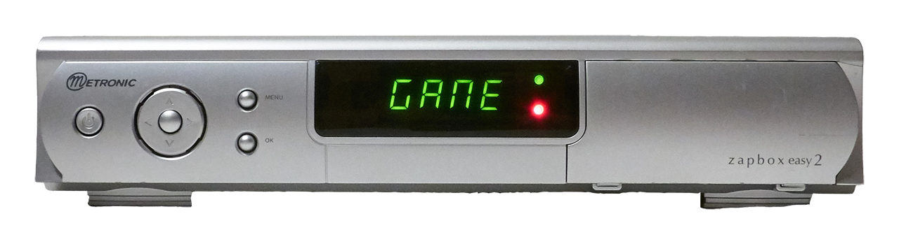
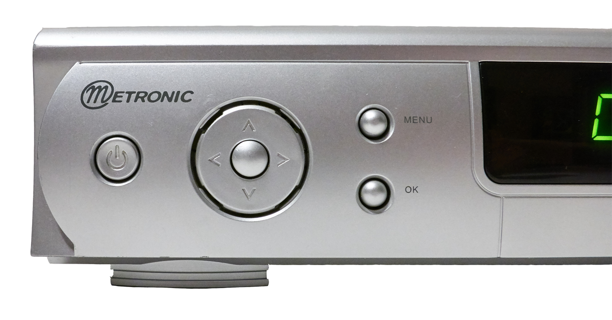
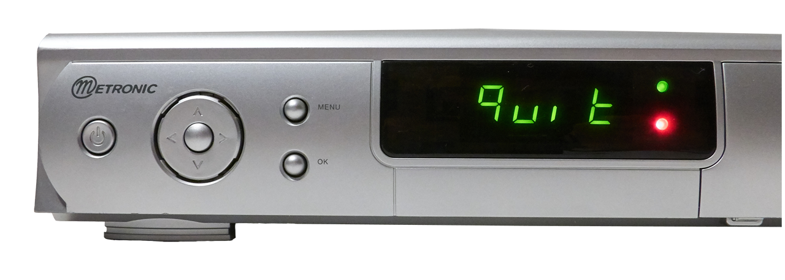

# Troubadour Front Panel usage

## The front panel

## Buttons
There are 7 push buttons on the front panel :   

### 1. The Power button

You can properly shut down the system by pressing once on the **power** button. 
The message *quit* appears on the screen, inviting you to confirm with **OK** or cancel with **MENU**.

### 2. Control the audio volume

With `^`and `v` buttons you can increase or decrease the volume. Be sure to have the `vol`script installed.   
See [vol_install.md](vol_install.md) for more details.   
The screen go black for less than a second each time these buttons are pressed, it's normal. 
The script is quiet slow to change the volume.

### 3. Display messages and info

With `<` and `>` you can display different information.   
By default the following messages will appears :
* GAME
* 1984
* 00:02  =>  The time *(hh:mm)* since the start of the system.   

If you want to add your messages or new functions see [frontPanel_hack.md](frontPanel_hack.md).
