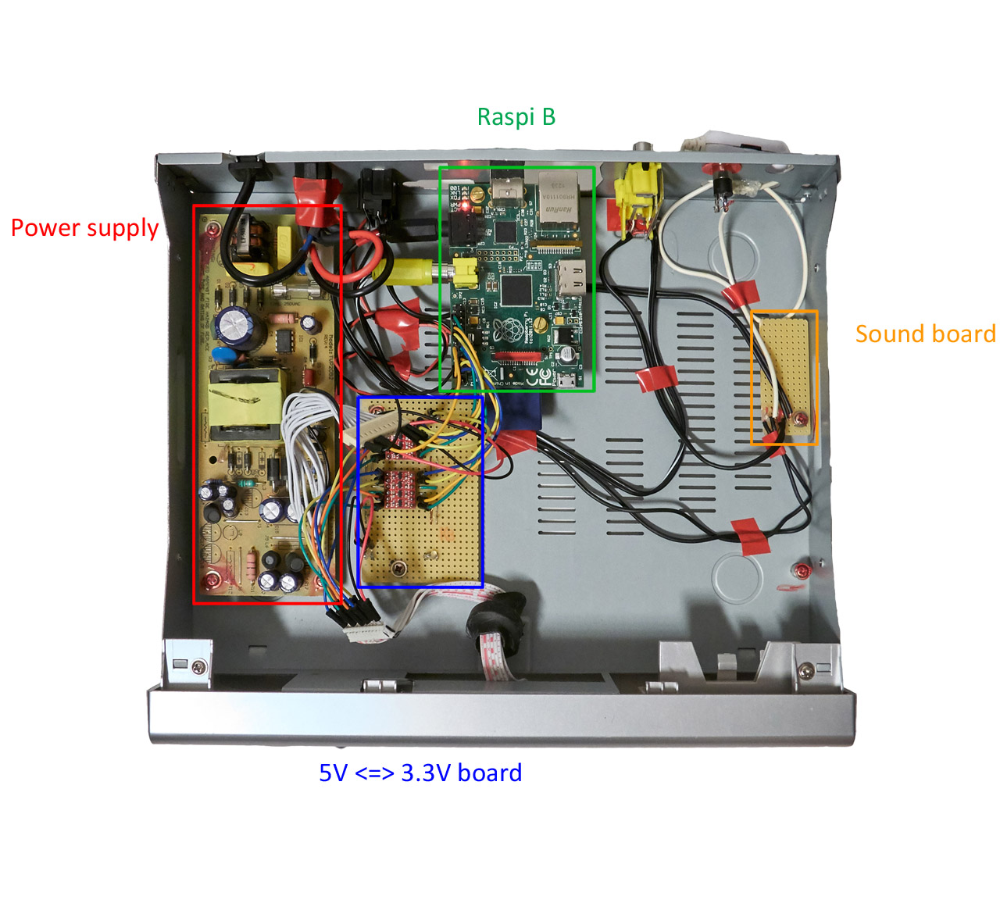

# Troubadour Wiring

## Main Parts


I removed the mainboard of the decoder and used the original screw and holes to fix the perfboards.   
For the Raspberry Pi, I did 2 holes in the bottom of the case and fix it using 2 bolts.
Th Pi doesn't touch the case thanks to plastic screw anchors.

See [schematics/MZE2_Troubadour-PinOut.pdf](../schematics/MZE2_Troubadour-PinOut.pdf) for 
a precise pin out of each connector.

### 1. Power supply   
It's the original power supply. In this project we use 3.3V and 5V channels.
We plug jumpers directly in the connector.   

IT COULD BE DANGEROUS, SO BE CAREFUL.   

IF YOU DO NOT KNOW HOW TO DO IT PROPERLY, DO NOT DO IT.   
I DISCLAIM RESPONSIBILITY IF YOU HAPPEN TO BE INJURED, 
OR IF YOU DAMAGE YOUR DEVICES.

### 2. Raspberry Pi B   
The core of the system, he controls the front panel.

### 3. Logic level converter board   
The front panel use 5V logic, and the RPi 3.3V. We used logic level converters 
from sparkfun soldered on a perfboard.

### 4. Sound board   
It's not really a sound board, just a piece of perfboard 
with all the sound wires soldered on it. 
The sound comes from the jack on the Raspberry Pi B then it is distributed
to all the connectors.

## Logic level converter wiring

```
      Front panel       Raspberry Pi B
      connector    -    BCM numbering    -    function
      5V side           3.3V side
	         _____
	  12----|     |----22                  digit 1
	  11----|Level|----23                  digit 2
	  10----|Conv.|----24                  digit 3
	   9----|_____|----25                  digit 4
	         _____
	   4----|     |----2                   Green LED
	   5----|Level|----3                   Serial In
	   6----|Conv.|----4                   Clock Pulse
	   7----|_____|----17                  Buttons
```   
